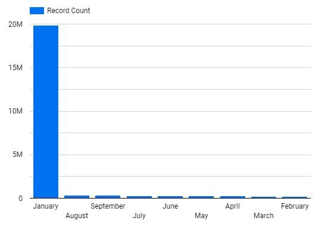

# Week 4 Homeowork

**SETUP:**
In this homework, we'll use the models developed during the week 4 videos and enhance the already presented dbt project using the already loaded Taxi data for fhv vehicles for year 2019 in our DWH.

This means that in this homework we use the following data Datasets list

- Yellow taxi data - Years 2019 and 2020
- Green taxi data - Years 2019 and 2020
- fhv data - Year 2019.

We will use the data loaded for:

- Building a source table: stg_fhv_tripdata
- Building a fact table: fact_fhv_trips
- Create a dashboard


**Question 1:** What happens when we execute dbt build --vars '{'is_test_run':'true'}' You'll need to have completed the "Build the first dbt models" video.

- It's the same as running dbt build
- It applies a limit 100 to all of our models
- It applies a limit 100 only to our staging models
- Nothing

```
It applies a limit 100 to all of our models
```

**Question 2:** What is the code that our CI job will run? Where is this code coming from?

- The code that has been merged into the main branch
- The code that is behind the creation object on the dbt_cloud_pr_ schema
- The code from any development branch that has been opened based on main
- The code from the development branch we are requesting to merge to main

```
The code from the development branch we are requesting to merge to main
```

**Question 3:** What is the count of records in the model fact_fhv_trips after running all dependencies with the test run variable disabled (:false)?
Create a staging model for the fhv data, similar to the ones made for yellow and green data. Add an additional filter for keeping only records with pickup time in year 2019. Do not add a deduplication step. Run this models without limits (is_test_run: false).

Create a core model similar to fact trips, but selecting from stg_fhv_tripdata and joining with dim_zones. Similar to what we've done in fact_trips, keep only records with known pickup and dropoff locations entries for pickup and dropoff locations. Run the dbt model without limits (is_test_run: false).

- 12998722
- 22998722
- 32998722
- 42998722

```sql
> stg_fhv_tripdata.sql

{{ config(materialized='view') }}

select
    -- identifiers
	dispatching_base_num,
    cast(pickup_datetime as timestamp) as pickup_datetime,
    cast(dropoff_datetime as timestamp) as dropoff_datetime,
    cast(pulocationid as integer) as  pickup_locationid,
    cast(dolocationid as integer) as dropoff_locationid,
    SR_Flag, 
    Affiliated_base_number
from {{ source('staging','fhv_2019') }} where pickup_datetime >= '2019-01-01' AND pickup_datetime < '2020-01-01'

```
```sql
> fact_fhv_trips.sql

{{ config(materialized='table') }}

with dim_zones as (
    select * from {{ ref('dim_zones') }}
    where borough != 'Unknown'
)

select 
    fhv_data.dispatching_base_num,
    fhv_data.pickup_datetime,
    fhv_data.dropoff_datetime,
    fhv_data.pickup_locationid,
    pickup_zone.borough as pickup_borough, 
    pickup_zone.zone as pickup_zone, 
    fhv_data.dropoff_locationid,
    dropoff_zone.borough as dropoff_borough, 
    dropoff_zone.zone as dropoff_zone,  
    fhv_data.SR_Flag,
    fhv_data.Affiliated_base_number 
from {{ ref('stg_fhv_tripdata') }} as fhv_data

inner join dim_zones as pickup_zone
on fhv_data.pickup_locationid = pickup_zone.locationid
inner join dim_zones as dropoff_zone
on fhv_data.dropoff_locationid = dropoff_zone.locationid

```


```sql
SELECT date_trunc(pickup_datetime, YEAR), count(*) as records
FROM `data-axiom-412014.prod.fact_fhv_trips` 
GROUP BY 1
ORDER BY 1 DESC;

```
```
22,998,722
```

**Question 4:** What is the service that had the most rides during the month of July 2019 month with the biggest amount of rides after building a tile for the fact_fhv_trips table?

Create a dashboard with some tiles that you find interesting to explore the data. One tile should show the amount of trips per month, as done in the videos for fact_trips, including the fact_fhv_trips data.

- FHV
- Green
- Yellow
- FHV and Green




```
Green
```

